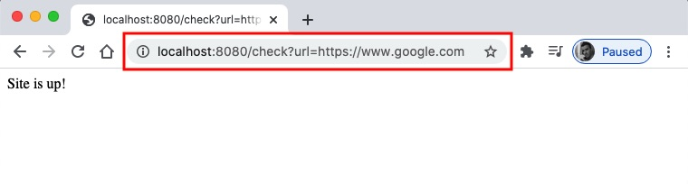

## Step by Step Guide - VS Code for Spring Boot Java Development**: https://www.youtube.com/watch?v=uq4GjRF_860&list=WL&index=3&t=1119s
> This video is a step by step guide to setup and develop Spring Boot applications using Visual Studio Code. I will be building a simple Spring Boot service from scratch using VS Code. I'll show you what extensions to install and how to use the VS Code features to develop and iterate on your Spring Boot application

### **VS Code Extensions**
- Java Extension Pack: https://marketplace.visualstudio.com/items?itemName=vscjava.vscode-java-pack
- Spring Boot Extension Pack: https://marketplace.visualstudio.com/items?itemName=Pivotal.vscode-boot-dev-pack


### Project
- Create `is-the-site-up` spring project: 
    - Windows: `Ctrl+Shift+P`
    - Mac: `Cmd+Shift+P`
- Create the java class: `xyz.youdev.isthesiteup.controllers.UrlCheckController.java`
    ```java
    package xyz.youdev.isthesiteup.controllers;

    import java.io.IOException;
    import java.net.HttpURLConnection;
    import java.net.MalformedURLException;
    import java.net.URL;

    import org.springframework.web.bind.annotation.GetMapping;
    import org.springframework.web.bind.annotation.RequestParam;
    import org.springframework.web.bind.annotation.RestController;

    @RestController
    public class UrlCheckController {
        private final String SITE_IS_UP = "Site is up!";
        private final String SITE_IS_DOWN = "Site is down!";
        private final String INCORRECT_URL = "URL is incorrect!";

        @GetMapping("/check")
        public String getUrlStatusMesasge(@RequestParam String url) {
            String returnMessage = "";
            try {
                URL urlObj = new URL(url);
                HttpURLConnection conn = (HttpURLConnection) urlObj.openConnection();
                conn.setRequestMethod("GET");
                conn.connect();
                int responseCodeCategory = conn.getResponseCode() / 100;
                if (responseCodeCategory != 2 && responseCodeCategory != 3) {
                    returnMessage = SITE_IS_DOWN;
                } else {
                    returnMessage = SITE_IS_UP;
                }
            } catch (MalformedURLException e) {
                returnMessage = INCORRECT_URL;
            } catch (IOException e) {
                returnMessage = SITE_IS_DOWN;
            }
            return returnMessage;
        }
    }
    ```

- Open: http://localhost:8080/check?url=https://www.google.com
